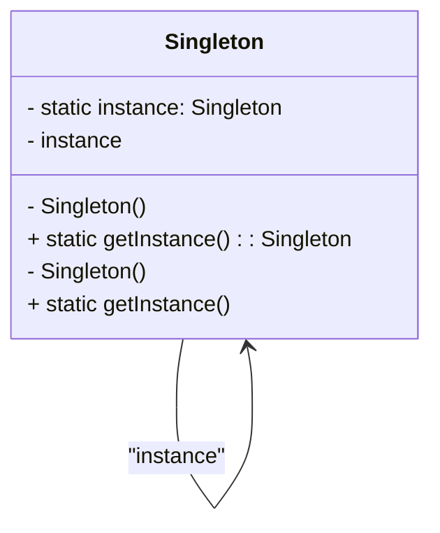
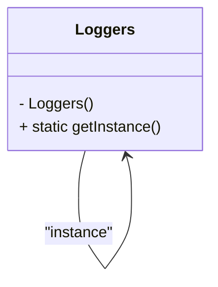

# Padrão Singleton

### Explicação
- **`-`** indica atributos métodos públicos.
- **`+`** indica métodos públicos.
- A classe `Singleton` possui um atributo estático `instance` e um método `getInstance()` para garantir um única instância.

### Diagrama do Código Exemplo

