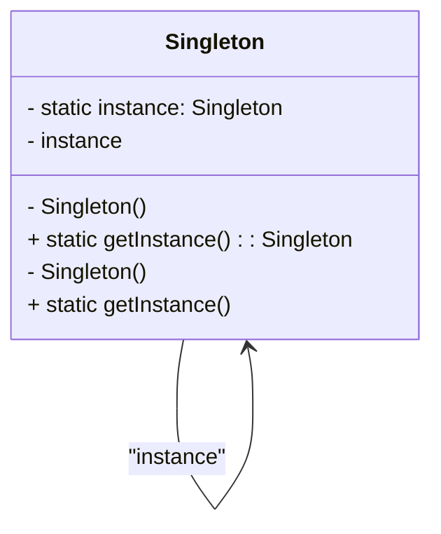
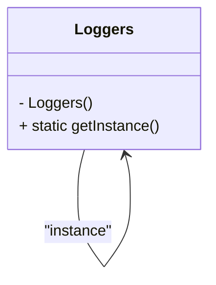

# Padrão Singleton

### Explicação
- **`-`** indica atributos métodos públicos.
- **`+`** indica métodos públicos.
- A classe `Singleton` possui um atributo estático `instance` e um método `getInstance()` para garantir um única instância.
- A linha `Singleton --> Singleton : "instance"` cria uma **auto-referência**, representando que a classe tem um atributo que aponta para si mesma.
- A etiqueta `"instance"` mostra que essa referência está associada ao atributo estático `instance`.

### Diagrama do Código Exemplo

